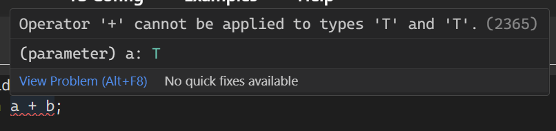
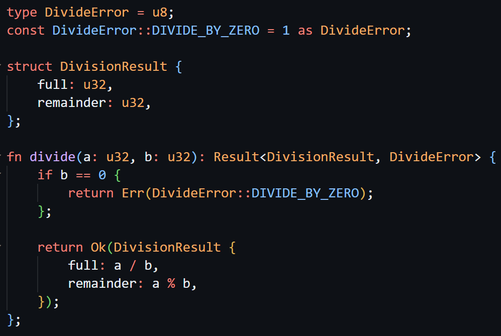
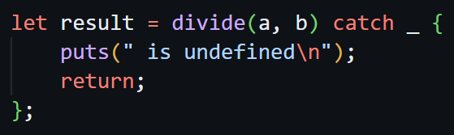

<div style="text-align: center;">
    
</div>

[GitHub Repo](https://github.com/glebbash/LO)

Oh it is soooo hard designing a language. I was stuck for months trying to design error handling. So I made a formatter, transpiler and an interpreter instead. (more on that in next DevLog probably)

## 😫 Design is HARD

But for real though, designing a programming language can be quite hard.

There are some problems I encountererd that just can not be solved simply. Let's go through some examples.

### 🪩 Generics / macros

Let's look at this "simple" example in JavaScript.

```ts
function add(a, b) {
    return a + b;
}
```

Say we wan't to make this generic function fully typed with TypeScript. Aight, we just add generic `T`, specify the types...

```ts
function add<T>(a: T, b: T): T {
    return a + b;
}
```

Looks good. Let's try this out...



Oops. We need to make sure that `T` is "addable".

```ts
function add<T extends number>(a: T, b: T): T {
    return a + b;
}
```

This still does not typecheck properly because of TypeScript quirks but it looks good enough. But what about other "addable" types? In JavaScript you can add strings together (concat), you can also add BigInt values.

What about not just JavaScript? On lower level there are a lot of "addable" types: `i8`, `u8`, `i16`, `u16`, `i32`, `u32`, `i64`, `u64`, `f32`, `f64`...

Who's gonna define those "addable" interfaces/types? How about other operators?

Even after you would do all of that work. It's still not that simple. On lower level there are no generic functions. You can only put one of the low level types into a parameter.

So you now need to generate multiple functions for each compatible generic type.

There is kind of a hack to avoid all of that complexity though: **macros**.

Here is an example from C:

```C
#define ADD(a, b) ((a) + (b))
```

Well now this does not come without problems either:
- you can't type-check macros before they are being used
- line numbers in errors are gonna get messed up after macros are expanded
- they always inline their contents and can lead to code bloat
- you can't have function pointers to macros (they do not exist at runtime)

> My current solution is to have a mix of both: macros but with typed signatures. This approach is not ideal and I will probably iterate on it a lot in the future.

### 📦 Modules / imports

Includes? Relative imports? Absolute imports? Network imports?

Having a module name in each file? Having a file name be module name? Not having module names at all?

What do you do with functions with the same name in multiple modules? Are types with same signature compatible with types from other modules?

You see where I am going with this. I don't even wan't to think about complexities of modules for now even though I probably will have to in the future.

> For now I just have simple includes like in C, with only difference being that they only include file once. Similar to `#pragma once` from C/C++ or `require_once` from PHP.

### 💥 Error handling

> Q: Exceptions?

Exceptions are bad, but they do come with a nice stack trace so you can debug your problem faster.

---

> Q: Maybe error codes?

The simplest solution huh. Problem is that when you need to pass additional information in the error it becomes a mess.

---

> Q: How about multiple returns?

Sounds nice. But did you know Go has a special case for declaring variables from multiple return?

Normally you can't redeclare variables:

```go
err := "bad"
err := "too bad" // ERROR: no new variables on left side of :=
```

But with multiple returns you can:

```go
x, err := 1, "bad"
y, err := 2, "too bad" // 🤡 this is fine 🤡
```

And you can't really avoid this kind of problems with multiple returns:
- you either have to name all your errors differently: which will be a mess
- or you do what Go did here: which is even worse because you can just forget to handle the error

And then comes the actual handling errors part: welcome to `if err != nil` circus.

---

> Q: Copy Rust's `Result` type?

That's where I am leaning towards for now, but it does have it's downsides as well.

For example, say you have `Result<OkStruct, ErrorStruct>` type.

What if `ErrorStruct` is huge? You are kinda forced to return a huge struct with default values for every successful operation. That's bad.

What if I pass it by reference? That's better, but now we are allocating memory for no good reason.

This can be solved with output pointer to `ErrorStruct` like many C programs do. But you can't have output pointer in the `Result` type, you have to pass it in function parameters.

> I will describe my current solution in [Rust Lies](#-rust-lies) below

---

👆 This list is not exhaustive, I won't go into details but here are some of the other ones: tagged pointers (and their usage), optional types and pointers, syntax 😵‍💫.

And these kind of problems pop up from time to time and make your life harder then it needs to be.

Problem is: you can't just solve those problems. There are pros and cons to each option and no matter what you choose your solution will have downsides.

Sometimes it's so hard to pick one of the solutions as being "good enough" that you just go in a loop checking if you missed something.

Heck I got so frustrated with error handling design that I couldn't keep working on LO even for an hour without constant distractions.

I would go watch YouTube after like 5 minutes of trying to code or just listen to the music staring at the code mindlessly.

Unfortunately 😔, there is no hack to make it easier here. You just need to keep banging your head against the problem for as long a you feel like the solution is not good enough.

What helped me at the end was to shut off **all** distractions and focus on the problem 100%. It's not that easy though and I still spent more then 2 months to find my good enough with error handling.

## 🤥 Rust Lies

So yeah, about Rust's great `Result` type...

Do you know the type of function this will generate when compiling to WASM?

```rust
#[no_mangle]
fn do_stuff(val: bool) -> Result<u32, u32> {
    if val {
        return Ok(1);
    } else {
        return Err(1);
    }
}
```

Wellp, it's `(i32, i32) => void`. Excuse me?

Apparently Rust (or rather LLVM) will translate your function returning `Result` into a function that uses output pointer.

Compiling to other targets will also get you different results.

`Predictable performance.` - one of the points on Rust's landing page. How can you predict performance when you can't even predict what the machine will execute?

Anyways.

So my solution to error handling for now is to use `Result` type. But not the liars `Result`, a true `Result` type:

Compiling to WASM it will **always** emit one (or more depending if the type is composite) values for `Ok` variant and a single `i32` fitting `Err` variant.

It's a bit easier to show with examples:

```lo
Result<u32, u32> // WASM (i32, i32)
```

```lo
struct Pos { x: i32, y: i32 };

struct Error { message: str, offset: u32 };

Result<Pos, &Error> // (i32, i32, i32)
Result<Pos, Error> // not allowed, error values must fit into `i32`
```

And because WASM is able to return multiple values with widely adopted [multivalue](https://github.com/WebAssembly/multi-value/blob/master/proposals/multi-value/Overview.md) feature, there are no lies in function definitions as well.

Sure, passing struct by value into a function in LO will produce multiple WASM function parameters and having local struct will create multiple WASM locals, but that follows a predictable pattern: composite LO type is represented as multiple lower level WASM types.

Here is how the error handling looks now:




Because there are no generics (yet?) and pattern matching, the `Result` type is a compiler built-in and I am using `catch` syntax similar to the one from Zig.

## ⭐ Starstruck

3 months ago [I posted about LO on Hacker News](https://news.ycombinator.com/item?id=40483367) and I did not expect anyone to notice.

What I got instead was:
- being on front page of Hacker News for like 3 days, 221 points and 63 comments on the post
- 435 stars on GitHub 🤯🤯🤯 (from less then 20), 2 issues, 4 pull requests, +1 contributor (even one change counts)

Thank you everyone for support 🥰. It really means a lot to me.

I was so fucking excited I told everyone I knew about it. I had a smile on my face for like a week.

But now that starfall is finally over I can get back to grind 🛠️. Next DevLog will prob focus on a bunch of new features in the compiler (not the language).

> P.S: You can already find WIP of those in the docs
