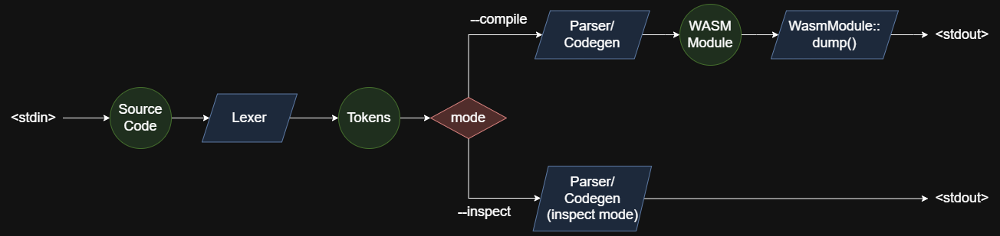
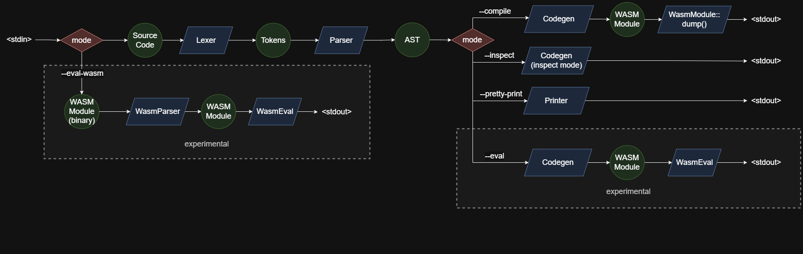
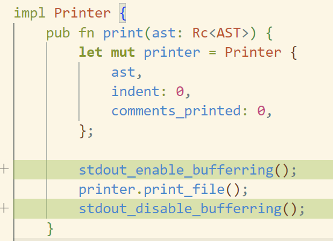
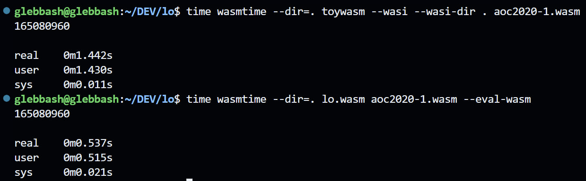

[GitHub Repo](https://github.com/glebbash/LO)

Aight, it's been 3 months since the last dev log, it's time to document 5 months of work 💀

> Yes, I had some stuff cooking at the time of last devlog, [first related commit](https://github.com/glebbash/LO/commit/91ec9c596382b1e18bd93e0053544a02b3757421)

## 🏭 V2 Pipeline

I want this project to be a learning resource and I will try to write ADRs for big changes/decisions done with all the reasoning and pros and cons.

I plan to have them in the docs folder of the repo but for now I only have some notes and I'll have to backfill a bunch for earlier decisions.

But for now I'll just write about the updates here.

---

Normally the compiler pipeline looks something like this:
- `lexer` - splits source code into tokens
- `parser` - builds an AST from tokens
- `ir-builder` - produces IR from AST
- `optimizer` - optimizes the IR
- `codegen` - compiles the IR for the target architecture

Because I was trying to make compiler small, originally I made a decision to simplify the pipeline to this:
- `lexer` - splits source code into tokens
- `parser/ir-builder` - parses tokens, keeping AST parts as function locals and builds WASM "IR"
- `codegen (WasmModule::dump)` - dumps the WASM "IR" using WASM binary format

The reasoning was that making AST isn't really needed to build WASM module and I would save a lot of lines by not defining all the AST nodes (~500LOC just for the types). 

This approach worked fine but it was limited in a way that there was only one global transformation possible: `you go from source code to WASM binary` (and also writing inspection info to stderr in `--inspect` mode).

But it turns out that having an AST unlocks a bunch of useful transformations you can do to the code apart from compiling:
- `formatting / linting`
- `transpiling`
- `interpreting`

I was interested in all of these: `formatter` - would improve the productivity, `transpiling` - possibility to transpile to C for example, `interpreting` - I would like to explore some compile time code evaluation similar to what Jai/Zig is doing.

So I went for a long migration to split Parser and Codegen to make AST available. Resulting in the following pipeline:
- `lexer` - splits source code into tokens
- `parser` - builds AST from tokens
- `codegen` - builds WASM "IR" from AST
- `WasmModule::dump` - dumps the WASM "IR" using WASM binary format

Here is the previous pipeline diagram:



And here is the new pipeline diagram:



It has a bunch more branches now but that's expected because it is now doing more different transformations (including experimental ones).

### 🛳️ The migration

The migration was done by first introducing a new compiler mode with a `--compile2` that did the same compilation process but now going through the AST. I updated all the tests to run on V1 and V2 modes making sure that all the features are supported from the old approach. After everything was migrated I just nuked the v1 code making v2 the only one (and also removing v2 postfix).

It was a very long and boring process just migrating the compiler so to spice it up I decided to experiment with some new additions in parallel:
- `Formatter`
- `Transpiler to C`
- `Interpreter`

## 💅 Strict Formatter

I think that questions like:
- > semicolon or no semicolon?
- > spaces or tabs?
- > 2 spaces or 4 spaces?
- > curlies on same line or curlies on next line?

are just really, really, really stupid.

Why? Because they should not exist in the first place. They should've been answered by the language creators.

### 🫠 A possible mess (rant)

JavaScript/TypeScript is an example of the worst case scenario: all of these questions were left to the users.

#### Semicolons

For some reason semicolons are optional. It's not like there are no semicolons at all (somewhat like in Python) and it's not like they are required. Everyone now has to decide for themselves whether to use them or not.

#### Naming conventions

There is no official naming convention. So you have to decide whether you want to use pascal-case or camel-case or snake-case or constant-case (thank god kebab-case and space case is not allowed). And not just once. You have to decide for class names, for method names, for function names, for variables and for constants.

The term combinatoric explosion is not even applicable here cause you can always invent a new naming convention making the amount of choices literally infinite. 

#### Style guide

It's not like you have to have a strictest style guide and always follow it. There are of course cases when different naming conventions make sence in parts of the program mostly when interfacing with existing libraries and APIs.

But there must be a **single** style guide for default.

JS/TS on the other hand has, ehmmm... a huge lot of them:
- Airbnb
- Google
- Idiomatic
- Standard JS
- TypeScript internal style guide
- ...

Why? Where is the ECMAScript style guide? I don't know.

The worst part is that very commonly the [Choise Paralysis](https://en.wikipedia.org/wiki/Analysis_paralysis) or just plain ignorance leads to JS/TS codebases having no style guides used, no formatters used and possibly having custom style guides where there are no formatters to automate the task. 

### 📝 Writing a Formatter

So I spent some time thinking about how to make a formatter.

On the first thought it's pretty simple: you take the AST from parser and you walk the nodes and you print the contents using the syntax of your language.

But you also need to think about:
- printing with correct nesting
- preserving comments in AST and printing them
- possibly splitting code into multiple lines when it hits some character limit

Correct nesting is pretty simple: you do your recursive traversal and pass the indendation level incrementing it when entering the blocks and decrementing when leaving.

Splitting code to hit 80 char column limit is apparently a [super duper hard problem](https://journal.stuffwithstuff.com/2015/09/08/the-hardest-program-ive-ever-written/) so I did the same thing as `gofmt` does: you just put all on the same line, if developers think it's too much they can make temp variables to split into multiple lines.

I though about some simple half-way solutions like putting function parameters (and arguments) on new lines if their count exceeds 3 but then I didn't really bother implementing that. 

But handling comments on the other is a must for any formatter:

#### Handling Comments

Formatting comments is much harder. You need to think of a good way to preserve the comments in the AST, so it involves at least updating a parser to do that (cause by default comments are ignored).

There were two approaches that I thought about first:
- storing them as fields on the AST nodes
- storing them as separate AST nodes

But there are problems with them:
- adding comments as fields will pollute the AST types, you need a good inheritence/composition tooling in the parser implementation language to make it clean(ish)
- comments can appear in a lot of places, so you need to make sure that AST structures have a lot of places where comment nodes can be stored

I immediately detected that these two are a no go because even thinking about all the cases makes my head hurt.

So I turned to searching for existing solutions to preserve comments in AST, and it turns outma very simple way exists: `you don't store comments in the AST`.

Similar to pratt-parsing this technique deserves a separate post. But I ain't in the mood for teaching big time yet so you'll have to do with a smaller description. (You can always reach out in case you have questions)

So the idea goes like this:
- you define all places where comments are expected to be after the formatting: for example it makes to sence to have a comment in between tokens of `let x = 1` but comments between expressions and functions are expected
- you store begin/end locations of those places in your AST, so for example each statement gets a begin/end position in the struct. I did is with a single `loc: LoLocation` field where `LoLocation` stored both begin and end positions
- you store comments in a separate array 

### Formatter is Just a Code Transformer

If you think about it, `formatter is just a case of code transformer`.

You can transform your code to make it prettier (formatter) or you can transform your code into code of other language (transpiler) or you can make your code more compact to save some space (minifier).

#### Transpiler to the Same Language

It turns out that making a formatter can actually help save time on language development.

If you do a bunch of syntax change iterations a formatter can be used to transform all existing code to new syntax automagically.

The idea goes something like this:
- you introduce a change to the language syntax
- you make ASTs of all the existing code with old syntax
- you use the formatter to pretty-print those ASTs with a changed syntax

> **Example case where it would save time**: You want to require semicolons in your language. You change the parser and now you get a bajillion parsing errors on all your existing example programs. Without a formatter that could insert semicolons automatically you'll have to go one by one and fix all code manually. And if parser only reports a single error at a time it would be even harder.

#### Failed Transpiler to C experiment (Formatter is not a Transpiler)

When starting implementing the formatter I though why not have a flag that would output C code instead of LO. Effectively making a transpiler to C and getting a new compilation target for ~~free~~ very little effort.

> Update: It actually might be that I started the whole V2 Pipeline thing because I wanted to experiment with C output

My language is on the same level in semantics to C so it shouldn't be that hard right?

Welp...

First of all, having another target language for a formatter means double the code. No matter how you structure it, either with 2 compiler classes (struct + impl in Rust) or just having a bunch of conditions you do get into roughly double the code anyways because of language differences.

Having double the code for feature that isn't essential is a big no. But I was still considering it as transpiling to C pretty much means you get the widest target coverage.

C code isn't a final target though and you'll need to have a C compiler then to get all the way. This on the other hand goes the opposite way of keeping dependencies to a minimum. But I was still considering having it as a secondary target becasue of the possibilites.

So I was making a transpiler to C (fucking always want to call it "C transpiler" but that's not correct) in parralel with the formatter but then I hit the roadblock.

LO and C semantics are similarish but not similar enough to be produced from only AST information.

What I though was that going from LO to C would be similar to TypeScript to JavaScript transpiler where you just remove the types (not true technically as TS to JS also involves desugaring and polyfilling).

In my case I though I would just rearange syntax constructs turning:
```Rust
fn main(): i32 { ... };
```
into:
```C
int main() {...}
```
And it was mostly working. Variable definitions had to use C23's `auto`. Making a solution for  `Result` using C struct/macros is also possible.

But then came `defer`, `macro`, `try/catch` and others issues 💀.

I am pretty sure it's possible to have a C23 target for LO and even C99 target (no `auto`), but the complexity of that far exceeds a simple code transformer and it becomes an actual compiler where you'll have to build and accumulate type information, do forward declarations, figure out mappings for all LO constructs and so on.

The complexity is comparable to building WASM IR/binaries, and would only makes sense if I'd make C the only target (getting to WASM is still possible through clang).

And after transpiler started to grow pretty big I decided to pull the plug and nuke it.

But it doesn't mean that I it's now not possible to use C libraries though: I might look into [WASM Object Files Linking](https://github.com/WebAssembly/tool-conventions/blob/main/Linking.md) in the future.

### Unbuffered output kills performance

But the formatter was a big success though. After dropping C target my productivity sky rocketed and formatted was done in less then a month (on and off) and was finished before  codegen migration to AST.

One discovery though was that printing each token with a call to `fd_write` (write to stdout) would have unusable performance in some cases.

Formatting a 20KLOC file (I embedded image data in the source code) took 6-10s when calling formatter through VSCode 💀.

Same file was formatted in under 150ms in wasmtime so I knew it wasn't my code being terrible. Turns out VSCode takes quite a lot of time on stdout write calls and I had to add output buffering to make the formatted usable.

It turned out to be quite simple and not intrusive at all:


It's not black magic and this optimization is very common and is even added by default in a bunch of places such as C stdio.

It took VSCode formatting speeds to usable (20KLOC in 150ms) and made running with wasmtime faster as well (20KLOC in 50ms).

---

So out of 3 experiments:
- formatter
- traspiler to c
- interpreter

The statuses in order are: `success`, `failure`, `undecided`

Let'sa check how interpreter experiment went:

## ♻️ WASM in WASM Interprepter

This one actually turned out kinda interesting.

The initial experiment involved interpretting the now produced AST. Which, ehhm, didn't go as planned.

The problem was that I would have to re-implement all the scoping and type building logic from the codegen and there wasn't any easy ways to just reuse the code because it relied on contexts etc.

So I went looking for the alternatives as interpreting LO could be big.

It turns out I didn't need AST creation step at all to make the interpreter: I could just interpret the generated WASM "IR".

Doing so will create WASM interpreter compiled WASM.


So I rushed creating the WASM interpeter which took ~1.5KLOC and supports a subset of WASM and WASI features that were needed to interpret all example programs I had.

But now having a WASM interpreter meant that I can not only interpret LO source code, but any program compiled to WASM.

That is, if I write a WASM binary parser to produce WASM IR that the interpreter uses. Fortunately WASM "IR" and the WASM binary format are very very close so writing a WASM parser was super quick as well (< 1KLOC).

I have module verification as a todo though so any malformed WASM modules would just make compiler panic.

### 🏎️ Interpreter Performance

Unfortunately because of security constraints WASM spec does not allow making executable memory chunks so it's not possible to make a JIT compiler compiled to WASM.

So the performance of any interpreter compiled to WASM no matter whether it's a Python interpreter or a JS interpreter is severely limited.

It doesn't matter much for hello-worlds and others, and I think that even having a full self hosted compiler's source interpreted won't take a huge amount of time.

But for even slightly heavier tasks like some brute-forcing solutions for AOC (Advent of Code) I have in examples the performance is pretty bad, like Python level bad, like 10-40x slower than the same code interpreted on native wasm runtimes.

Interpreting 6 AOC tasks from examples takes 2.5 seconds compared to 200ms it takes Node.js to run (including module loading) the same WASM code.

The interpreter isn't like formula one optimized, but I did look into performance to reasonable extents including prebuilding jump tables for loops and conditionals thus lowering them to gotos, not doing unnecessary allocations etc.

Just for funsies I found [toywasm](https://github.com/yamt/toywasm) which is another WASM in WASM interpreter to use as performance baseline. And mine is about 2-3x faster 😎



### Interpeter Experiment Status: undecided

Even though the interpreter works, I am not sure how it will be.

It's possible to use WASM interpreter to get some small stuff done like constant folding or even try to go for full compile time code execution ala Zig.

It's also possible to combine interpreter with WASM parser and allow to interpret code compiled to WASM from other languages. It could be used for compiler plugins for example.

But currently WASM interpreter and WASM parser only support a subset of WASM features and I don't yet see a clear future for both additions.

Supporting full WASM 1.0 compliance makes no sense for now and I don't plan to look into compile time execution for near future.

So the code is in a limbo state for now. And I am undecided whether I should keep or remove it.

### 📈 Code size increase

Using `npx kloc src` and some GitHub commit searching I found out that code amount increased from ~6KLOC to ~11KLOC in the past 5 months which makes me kinda 😭 as I want to make the compiler as small as possible.

Introducing the AST creation step added ~2KLOC to match the same features. That's about what I was expecting when deciding not to do AST in before.

And addition of formatter brough ~1KLOC but it is definetely a big plus for the compiler.

> Because AST interpreter didn't work out, AST creation is now only needed for codegen and formatter which makes formatter cost actually ~3KLOC 🫠

As for WASM parser/eval (~3KLOC) code, it's possibilities are pretty interesting but no language features depend on it yet and it's nicely separeted so it can be easily removed if it won't bring value.

---

The next step I guess is going self-hosted (which I am trying to do since creation) which involves getting LO to a confortable feature level and port >10KLOC of Rust.

It's gonna unlock a LOt of possibilities but will also take a LOt more time so I'll probably get bored again and find some other tangent soon.
