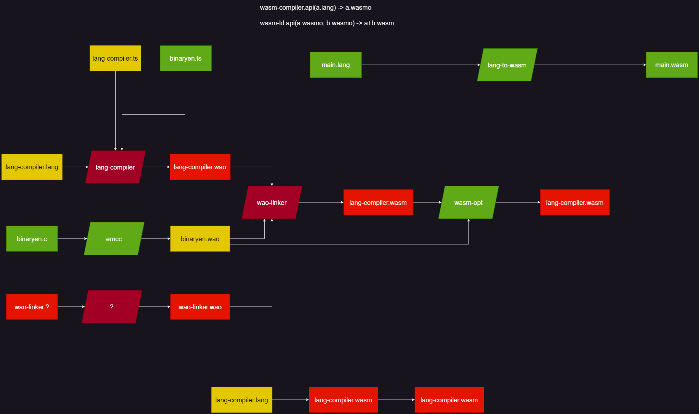

Nowadays it's really hard not to use ChatGPT for writing ...

But rest assured: I used none of it and as a bonus I didn't even use spellcheck
or Grammarly so expetc some typos and grammar bad.

> P.S: The 3 month time since the last post is because of uni. Oh how I hate
> uni. 🤮

[GitHub Repo](https://github.com/glebbash/LO) |
[Previous Post](./devlog-4)

## ⛵⛔ Sailing off course

The goal of the language I am making is to allow users to modify the compiler
themselves to make it fit the problem / their preferences.

My vision was that the compiler will consist of modules like:

- lexer/parser
- intermidiate-representation
- optimizer/etc
- compiler/transpiler/interpreter.

And you will have this cool pipeline with hot-swappable modules. See [The Idea]
section from the second DevLog to see the write-up on possibilities of this kind
of system.

Also one addition to the possibilities that I didn't describe is that the
compiler doesn't have to be this one thing. If the pipeline will be embeddable
enough it will be possible to use it with some modules swapped for syntax
highlighting, linting/formatting and even [language server].

As I was using LLVM and binaryen I needed to have them as modules as well.

Here is my attempt to design integration with Binaryen for self hosting
compiler:



If you don't understand what's happening here - good. As I don't understand this
either. Trying to use binaryen or LLVM and make compiler embeddable is not
really possible it seems.

Just look at the sizes of these libs:

- LLVM: ~30mb
- binaryen: ~5mb

I wouldn't really want to use a lib that is 30mb. And this is only possible when
compiled with proper flags.

So I decided to trash whatever I was doing before and rethink my approach.

Changes to the plan:

- targetting WASM only
- not using any libraries and implementing everything from scratch
- trying to make compiler as simple as possible
  - preferrably keeping it in single file 😳
- make the first compiler compile to WASM natively so that I don't need to make
  a compiler for compiler first

And this is where I had a need to change the language for initial compiler
implementation.

## 🔄️ Switching the language

I needed a language with good WASM support of which I know:

- Rust
- Zig
- AssemblyScript

I discarded AssemblyScript as it is too high level and it would be hard to port
the compiler for self hosting.

As I already tried Rust for [Advent of Code 2022] I deciced to try Zig because
comptime magic looked interesting.

Immediately I found some DevX problems:

- GitPod doesn’t have built-in Zig support 😒
- I need to build Zig language server from source 🤮

I really tried to use it, but I just rage quit without even commiting anything
to the repo, just nuking everything I wrote.

Well, Rust it is.

Rust language server (rust analyzer) is automagically installed by VSCode
extension and GitPod has built-in support for Rust which is a god-send.

## 🦀🦀🦀 Rust rewrite 🦀🦀🦀

There is nothing that makes any project instantly 10x better than a Rust
rewrite.

Rust is very good language, but configuring the project for minimal WASM output
took some time.

I did almost everything the hard way (by figuring out everything myself) until I
found the great article about doing it the _hard way_ properly:
[Rust to WebAssembly the hard way]. Great article, describes pretty much all the
problems I encountered, pretty much a step-by-step tutorial to follow if you
want to do try this for yourself.

The thing I am trying to when using Rust for this project is using high level
features like iterators, traits and some other goodies. The less features of the
Rust I will you the easier it will be to port the compiler.

## 🤯 There is no allocator

So I was researching what needs to be implemented for the simplest self hosting
compiler.

And then I had enlightening experience:

> Me: Ok, "hello world" and other simple stuff works. Now, how do you work with
> memory in WASM?

WASM: Well, you can:

- use `memory` segment to define a starting amount of memory to be used by your
  program
- use `memory.grow` instruction which grows the memory by 64KB (page size)
- use `<type>.load` and `<type>.store` instructions for reading and writing
  primitive values to memory.

> Me: Ehmm, that's cool but where do I import functions like `malloc` and `free`
> from?

WASM: There's no such functions.

> Me: Wait. What does this even mean? HOw ARe YOu sUPPOsed tO allocate then?

WASM: Well, you need to implement `malloc` or `free` yourself.

> ME: ☠️☠️☠️☠️☠️☠️☠️

WASM: 🗿

---

This was actually a very useful insight into how computers work for me, which
never really clicked before for some reason:

> There is no such thing as allocating memory. - me

Memory allocation is not the responsibility of the OS, it is the responsibility
of each program, and if you are not using a standard library you need to
implement an allocator yourself.

And I never thought about this while using C. Oh how much I was taking it for
granted ...

## Using ready allocator

So, because implementing an allocator would be a pretty big detour from my goal
I decided to use allocator from `crates.io`.

First thing that I found was [wee_alloc] which is an allocator made with WASM in
mind but apparently it's not maintained anymore and there are issues reported
about memory leaks and some other scary words.

My second find was [lol_alloc]. It is like `wee_alloc`, but smaller since the
author `used skinnier letters in the name`. Not even joking here, check the
docs, it's such a genius idea.

P.S: I'll still need to implement an allocator for self-hosting but I can do it
much later on.

## 🌴 No lib heaven

So at the time I was watching [Toding](https://www.youtube.com/@Tsoding/videos)
and got really inspired. He is streaming doing `recreational programming`.

How I understand it is: `you do what you like and don't to what you don't like`.

And the thing that is actually a pain in the ass is: `using libraries`. Sure
they do the work for you but they bring **unacceptable** amounts of complexity.

Just think about it, you only use some features from the library but still
depend on it, and then that library uses little features from other libraries it
depends on and then you have your 2GB `node_modules` folder.

And compiled languages don't solve this problem either. Sure unused functions
will not be added to the binary but they still increase the compile times.

So here is what libraries I am using currently:

```toml
[dependencies]
lol_alloc = "0.3.0"
mini_leb128 = "0.1.1"
```

**That's it**. Both of them have no dependencies and don't even need standard
library to work.

Compare this to a random TypeScript project:

```json
"dependencies": {
  "@google-cloud/spanner": "^6.4.0",
  "@nestjs/common": "^8.4.7",
  "@nestjs/core": "^8.4.7",
  "@nestjs/platform-express": "^8.4.7",
  "@nestjs/swagger": "^5.2.1",
  "@nestjs/terminus": "^8.0.8",
  "class-transformer": "^0.5.1",
  "class-validator": "^0.13.2",
  "dotenv": "^16.0.1",
  "dotenv-expand": "^8.0.3",
  "env-var": "^7.1.1",
  "env-var-base": "^1.3.2",
  "google-spanner-migrations-runner": "^1.4.0",
  "nest-winston": "^1.6.2",
  "nestjs-pubsub-core": "^1.6.0",
  "nestjs-pubsub-transport": "^1.10.0",
  "panic-fn": "^1.2.1",
  "reflect-metadata": "^0.1.13",
  "rimraf": "^3.0.2",
  "swagger-ui-express": "^4.4.0"
},
"devDependencies": {
  "@commitlint/cli": "^17.0.2",
  "@commitlint/config-conventional": "^17.0.2",
  "@nestjs/cli": "^8.2.6",
  "@nestjs/schematics": "^8.0.11",
  "@nestjs/testing": "^8.4.7",
  "@types/buffer-crc32": "^0.2.0",
  "@types/express": "^4.17.13",
  "@types/jest": "^28.1.2",
  "@types/lodash.chunk": "^4.2.7",
  "@types/ms": "^0.7.31",
  "@types/node": "^18.0.0",
  "@types/supertest": "^2.0.12",
  "@types/tmp": "^0.2.3",
  "@typescript-eslint/eslint-plugin": "^5.28.0",
  "@typescript-eslint/parser": "^5.28.0",
  "eslint": "^8.18.0",
  "eslint-config-prettier": "8.5.0",
  "eslint-plugin-prettier": "^4.0.0",
  "eslint-plugin-simple-import-sort": "^7.0.0",
  "husky": "^8.0.1",
  "jest": "^28.1.1",
  "jest-sonar-reporter": "^2.0.0",
  "ms": "^2.1.3",
  "prettier": "^2.7.1",
  "simple-git": "^3.8.0",
  "supertest": "^6.2.3",
  "ts-jest": "^28.0.5",
  "ts-loader": "^9.3.0",
  "ts-node": "^10.8.1",
  "tsconfig-paths": "^4.0.0",
  "typescript": "^4.7.4"
},
```

I hope you can see which of these is better.

So basically not using libraries is a breath of fresh air and it's fun to
implement stuff that you need without just adding a ton of libraries.

To bring this to extremes I'm trying to keep compiler as simple as possible and
aiming for a single file with ~3K lines of code.

Yes you heard it right, **single** file and **~3K lines** of code.

## 💾 Emmiting WASM without libs

I won't go into details of what is needed to build WASM binaries from scratch.

But it is actually pretty simple, binary format is not scary at all and there is
good documentation. Links I used:

- [Learning WebAssembly #2: Wasm Binary Format]
- [WASM spec]

Also I learned about this cool number compression format called Little Endian
Base 128 ([LEB128]) which is used in WASM binaries. I used the minimal
[mini_leb128] library because my language is lacking some features now but I am
really looking forward into implementing it myself.

It's nice that WASM MVP is so simple but apparently it is moving into the
direction of becoming the next JVM with
[all of those new proposals][wasm-proposals]. But I am good with using it at
this stage so whatever.

## 📈 Progress

As for the current progress of the compiler, here is a sample program it can
compile to WASM:

```clojure
(import fn fd_write [
    (file_descriptor u32) ;; file_descriptor
    (&iovs           ptr) ;; The pointer to the iov array
    (iovs_len        u32) ;; Amount of IOVec
    (&nwritten       u32) ;; Pointer to store the number of bytes written to
] [i32] :from wasi_snapshot_preview1 fd_write)

(mem m1 :min 1000)
(export mem m1 :as memory)

(struct IOVec (base ptr) (len u32))

(global FD_STDOUT u32 1)

(data 8 SGVsbG8gV29ybGQhCg==)

(export main :as _start)
(fn main [] [] (
    {&iov : ptr}
    {&iov = 0}
    
    (store IOVec &iov (struct.new IOVec 8 13))

    {_ : i32}
    {_ = (fd_write FD_STDOUT &iov 1 20)}
))
```

If you are curios what this does you can ask ChatGPT to decypher it. It
understands it easily.

The end.

[Next Post](https://www.youtube.com/watch?v=dQw4w9WgXcQ)

<!-- Links -->

[The Idea]: https://carrot-blog.deno.dev/lo/devlog-1#%F0%9F%92%A1-the-idea
[language server]: https://en.wikipedia.org/wiki/Language_Server_Protocol
[Advent of Code 2022]: https://adventofcode.com/2022
[Rust to WebAssembly the hard way]: https://surma.dev/things/rust-to-webassembly/index.html
[wee_alloc]: https://github.com/rustwasm/wee_alloc
[lol_alloc]: https://github.com/Craig-Macomber/lol_alloc
[Learning WebAssembly #2: Wasm Binary Format]: https://blog.ttulka.com/learning-webassembly-2-wasm-binary-format/
[WASM spec]: https://webassembly.github.io/spec/core/binary/instructions.html
[LEB128]: https://en.wikipedia.org/wiki/LEB128
[mini_leb128]: https://docs.rs/mini_leb128/latest/mini_leb128
[wasm-proposals]: https://github.com/WebAssembly/proposals
