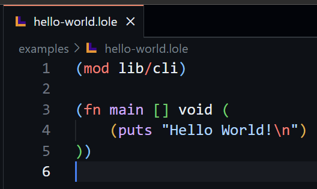
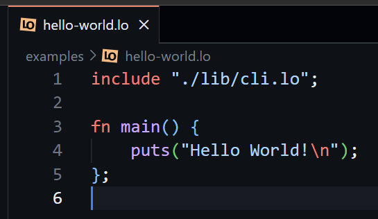
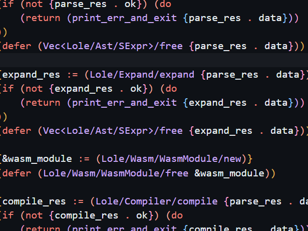
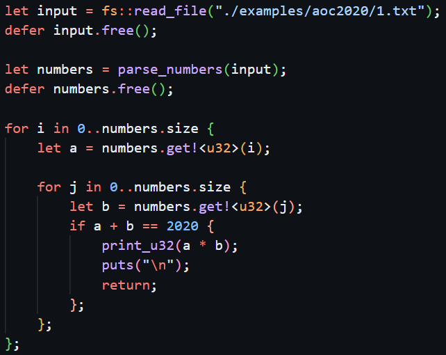
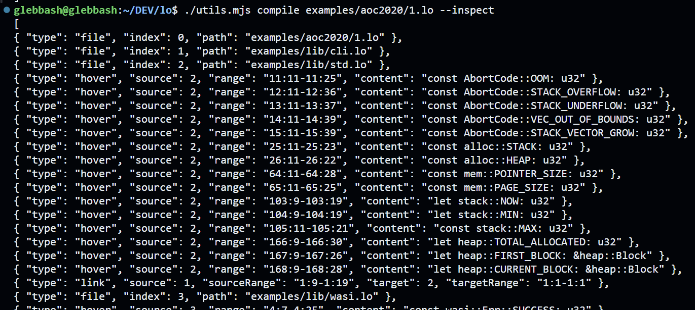

[GitHub Repo](https://github.com/glebbash/LO) |
[Previous Post](./devlog-5)

Well it's been almost a year since the last dev log.

It's time to reveal what I was working on this whole time.

~~I definetely was not just too lazy to blog.~~

## 👄 New name

The old name was `lole-lisp`. Which stands for `LOw LEvel LISP`.

I decided to try chopping it in half and got `lole`.

I liked really liked chopping stuff in half so I did it again and got `lo`.

Chopping it in half again yielded [L](http://l-lang.org) and [O](https://o.readthedocs.io/) but both of them are existing programming languages 🤦. I know right, someone also likes chopping stuff.

So I backtracked a bit and stopped at `lo`. I like it. 👍

But because a bunch of fonts display `l` and `1` pretty much the same, the name will need to always be capitalized.

So that is the origin of:

> And that 👆 is a new icon

## 🔥 New syntax

Old syntax was Lisp-like ([s-exprs](https://en.wikipedia.org/wiki/S-expression)) because that's the simplest thing to parse and I thought that would also mean that's the simplest syntax there is.

S expressions are indeed simple and powerful. But you know what is even simpler and can express much more information that that?

It's **binary**. Yeah that binary: `01100001 01110011 01110011`.

The thing is no matter how simple it is to parse S expressions, this process will only return S expressions, but now in a form of a tree instead of the text. You'll then need to parse them again and build your constructs like conditionals and function calls and stuff...

Hmm... So I though:

> How about I just skip the step with **a lot of parenthesss** and only parse the minimum that is required to build the constructs.

😲 What a great idea.

So:

1. I **kept the core language**.
2. Added an optional flag to the top of the file that would switch from parsing `v1` 🤮 to `v2` 😎.
3. Stole Rust's syntax. ([literally](https://github.com/glebbash/LO/blob/f8f3686e828a9972d7d0c65b442fd7caaea975ae/vscode-ext/syntaxes/lo.tmLanguage.json#L3))
4. Rewrote all examples one by one, testing the new features as I went.

And that's how I got from this:

To this:

> (the joke is that it's pretty much the same)

But when the code gets bigger then hello world you can clearly see the problem with `v1`:

`v1` syntax gets **noisy** very fast:

- using [M expressions](https://en.wikipedia.org/wiki/M-expression) does help but it still requires constant juggling with parentheses and curlies.
- while reading it I was sometimes lost: it looked like a blob of something that required looking harder to understand what is going on
- it just isn't possible to have some constructs with S and M expressions (like method chaining)

And now a piece of `v2` beauty:

> Comparision is apples to oranges (~~rigged to trash v1~~) to show how I feel about the changes

### 🪄 Pratt parsing

Parsing the new syntax was actually very easy as well. It actually resulted in less code for parsing: from `3.6K` to `3.4K` lines (while having more features).

The reason behind is the use of a brilliant algorithm called `Pratt Parsing`.

I think a lot of people are just not aware of how simple parsing **any language** can be.

And not simple as in:

- I'll just `npm install super-parser` (and wait for 3MB download).

But as in:

- Let's look up a refresher on how `Pratt Parsing` works and code the whole parser **from scratch** in 10 minutes in **any language**.

I might someday write about `Pratt Parsing` but for now here are some sources that I used:

- [Pratt Parsers: Expression Parsing Made Easy](https://journal.stuffwithstuff.com/2011/03/19/pratt-parsers-expression-parsing-made-easy/)
- [Simple but Powerful Pratt Parsing](https://matklad.github.io/2020/04/13/simple-but-powerful-pratt-parsing.html)

### 🧰 New features

Changing the syntax was like a breath of fresh air.

Instead of worrying all the time to not make the code more unreadable (in `v1`) it allowed me to efforlessly add many useful features like: `for loops`, `methods (with chaining)`, `nested symbols`, `typed macros` and `first class error handling`.

I don't yet have any docs showcasing the features (or any docs at all) but you can check the first [5 days of Advent of Code 2020](https://github.com/glebbash/LO/tree/main/examples/aoc2020) or [standard library](https://github.com/glebbash/LO/blob/main/examples/lib/std.lo) in the [examples](https://github.com/glebbash/LO/tree/main/examples).

I only stole Rust's syntax highlighting grammar because it's kinda what I want the language to look like. I won't be adding any Rust features though, feature wise the language will be close to C / Go with basic syntax simillar to what modern languages (like TypeScript / Kotlin / Swift / Rust) have.

## 💡 Code-assist without language server

And I was `oh 🤙 so 🤙 hyped 🤙` to implement the starter code assist in a week.

Here is the demo:

<video controls>
  <source src="./assets/code-assist.mp4" type="video/mp4">
</video>
   <!-- need some padding -->

Because the only code target is WASM. I can just **embed** the **whole compiler** into VSCode extension (or any other IDE that can run WASM/WASI).

It does not require running a standalone language server and going through the complexities of JSON parsing and learning LSP protocol.

I just add the `--inspect` flag which will tell compiler to print all the info for code assist like this:

> NOTE: This is a custom inspect log format to make it easy to adapt to VSCode APIs.

And then I just [wire it up to VSCode APIs](https://github.com/glebbash/LO/blob/main/vscode-ext/src/extension.ts) in ~300 lines of TypeScript.

You can check the full source of the extension [here](https://github.com/glebbash/LO/blob/main/vscode-ext).

This might not be a final solution as it might have problems with big projects and I don't yet know if this can support autocomplete...

But for the amount of effort it took to implement the results are **very nice** 🤌.

### 🔮 The future

There were a lot of improvements that I am too lazy to write about as well.

But now, having:

- go-to and hover assists
- new poggers name and syntax
- and only 15 TODOs left in the whole project

I might finally be ready to start rewriting the compiler from `Rust` to `LO` to get to my ultimate goal of [self-hosting](<https://en.wikipedia.org/wiki/Self-hosting_(compilers)>).

[Next Post](https://www.youtube.com/watch?v=dQw4w9WgXcQ)

<!-- Links -->

[link]: https://somewhere.com
